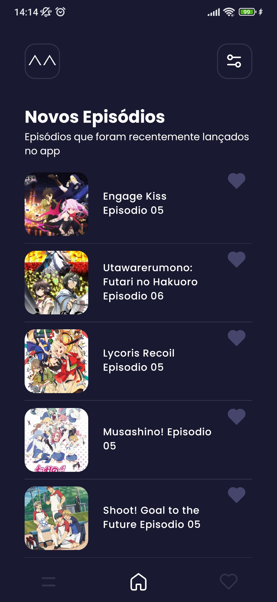
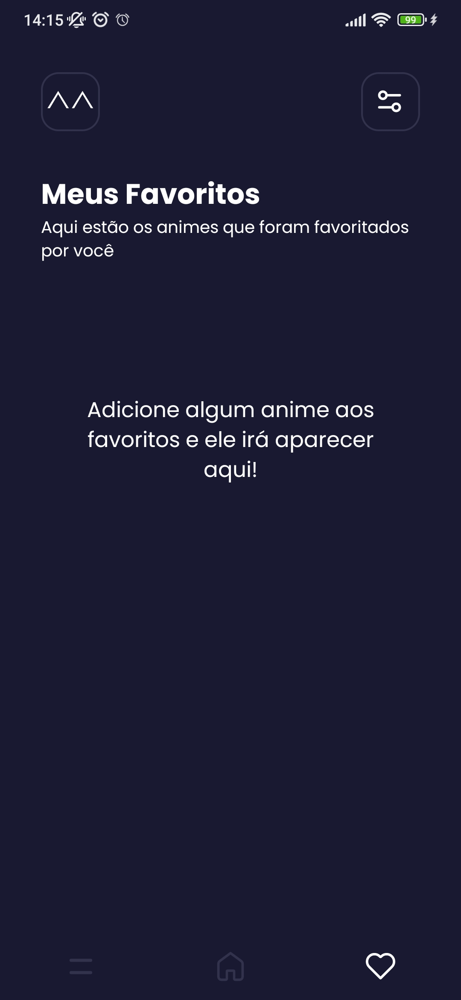
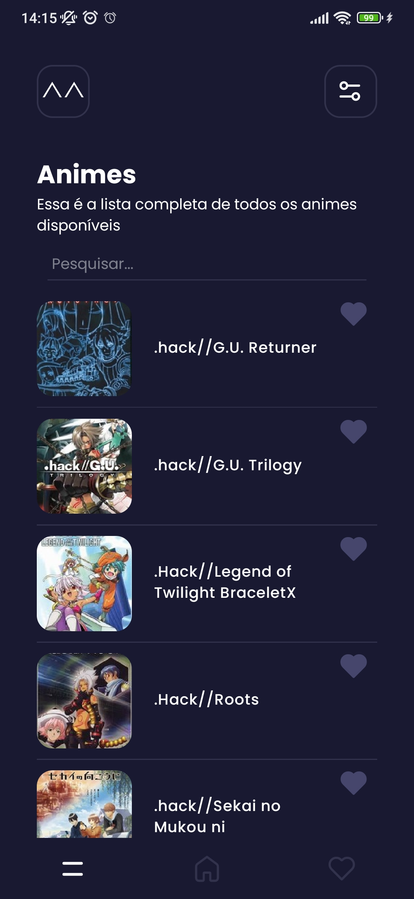
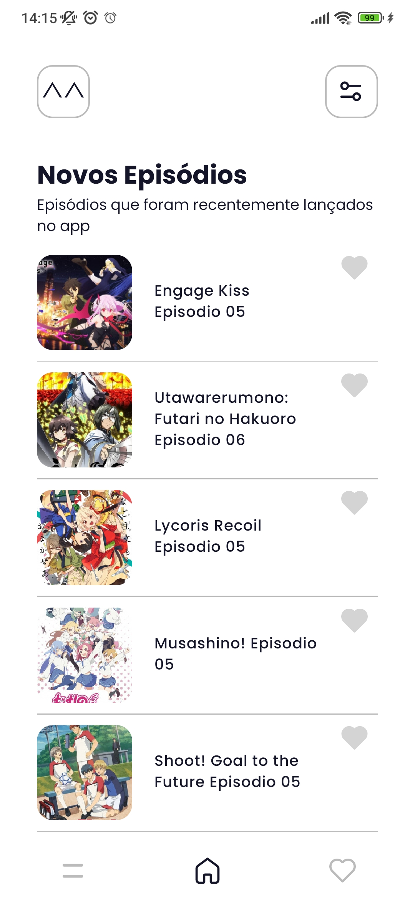

<div align="center">
  
</div>
<p align="center">
    Application developed with TypeScript using the React Native
</p>

---

# animeeb


### Features

- [x] Save animes on your own favorite list
- [x] Watch history
- [x] Dark/light themes
- [x] Watch videos on external players
- [ ] Download videos

### Screenshots

<div align="center">
  
  
  
  
  
</div>

### Downloading the app

You can download the latest version of this app by clicking [here](https://github.com/leduard/animeeb/releases/latest/download/animeeb.apk) or you can check all releases on this [page](https://github.com/leduard/animeeb/releases)

# Running this project

### Install all dependencies

```bash
yarn install
```
Or using npm (not recommended)
```bash
npm install
```

### Running on device

- `android`: `react-native run-android` installs the development mode application on the virtual device or connected USB device (android)
- `ios`: `react-native run-ios` installs the development mode application on the virtual device or connected USB device (ios)
- `start`: `react-native start` runs development server on port 8081

Run any of these commands with `yarn` or `npm run` before (`yarn android` `npm run android`)
